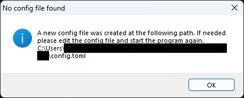
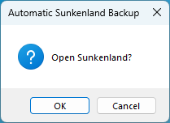
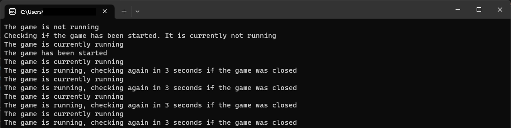
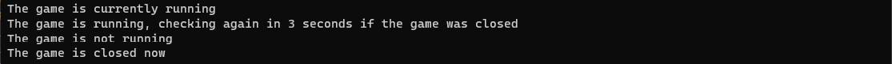
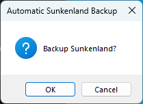
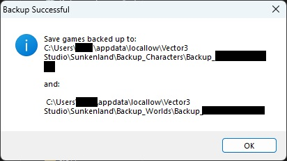

# Automatic Backup for Sunkenland

This tool is able to start Sunkenland, wait until you are done playing and after you close the game, it will do a backup.

If you execute this program, it will check for a "config.toml" file in the current directory. If there is no config file present,
it will create one. If needed, edit the config file and execute the program again.
If Sunkenland is closed after playing, it will create a backup of Sunkenland

## Quick Start

### First start

If you open "automatic_backup_for_sunkenland.exe" for the first time, it will show the following window and create a config file:

The "config.toml" will be created in the same directory. You can edit the config file if you like, but the default config should be good for the first usage.

### Second start

Now that the config file exists, the tool will run normally.
You can click "ok" to start the game or "cancel" to exit the tool

After you click "ok" you will see the following console window, which will wait until the game is opened. The status will be constantly printed, but normally you can ignore it.

### End of Game

After you played a session of Sunkenland, and exited the game, the console window will show the following, but you can ignore it as well.

You will now be asked if you would like to create a backup.
You can click "ok" to backup Sunkenland or "cancel" to exit the tool

After you click "ok", you will see the following window, which will tell you, where your backup is located:

Done, that's it 🥳

## Automatically open and backup the game

If you would like to automatically open and backup the game, you can edit the following variables in the config file:

ask_bevor_start = "no"  
ask_bevor_backup = "no"
